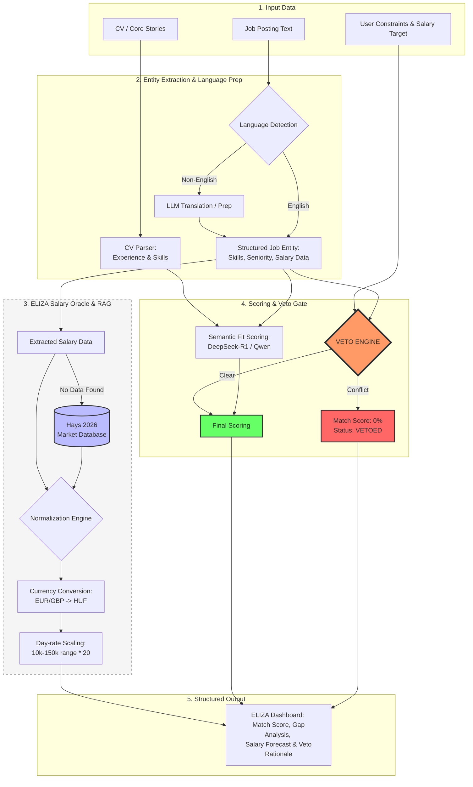

# ELIZA: Empathetic Link for Intelligent (Z)Job Acquire

**Local-first, deterministic job-fit copilot** for developers who want **transparent math**, not a mystery percentage. ELIZA is a **Copilot workflow**: it prioritizes quality, relevance, and user oversight over mass-automation. Paste a posting, compare it to your CV through a staged pipeline (parsing -> structuring -> matching -> scoring), then optionally draft application assets—all via **[Ollama](https://ollama.com)** on your machine.

---

## Why ELIZA

- **Fit-first** — ELIZA helps you decide whether to apply before generating assets.
- **Copilot UX** — user-in-the-loop by design; suggestions are visible and reviewable.
- **Deterministic pipeline** — parsing, structuring, matching, and scoring are explicit stages with auditable outputs.
- **Auditable scores** — the semantic model returns **`score_components`**; the API **reconciles** the headline **`fit_score`** with the structured sum and the **6–7** lines of **`mathematical_breakdown`**.
- **Semantic highlights** — short phrases from the job text, labeled positive or negative, with rationale for the UI highlighter.
- **Constraint-aware** — saved preferences and hard vetoes (including explicit negative constraints conflicting with required skills) surface in the dashboard and API.
- **Salary Oracle intelligence** — posted salary extraction with strict validation, currency-aware parsing, total-compensation signals (base/bonus/benefits), and market fallback benchmarks.
- **No cloud inference required** — PDF CV parsing and LLM calls stay on your network when Ollama runs locally.

---

## How it works

ELIZA follows a deterministic, pipeline-based flow from raw inputs to dashboard output:



1. **Job / CV** — You provide posting text and a stored CV (uploaded PDF).
2. **Extraction** — **English-first:** a fast token-signal heuristic on job text and CV text decides whether to **skip** the LLM language/translation step. If confidence is low or the sample looks non-English (for example German orthography in the prefix), the pipeline runs **automatic translation prep**, then **structured entity extraction**. The CV path always extracts skills, seniority, and core stories.
3. **Pruning** — A compact CV profile is built for the scorer (token budget, noise-stripped experience lines).
4. **DeepSeek-R1 scoring** — Default stack targets **`deepseek-r1:8b`** (or any Ollama tag you select). A baseline literal score is merged with the LLM semantic review, **`score_components`**, and hard-veto logic.
5. **Salary Oracle** — Posted salary (when valid) is prioritized over benchmark lookup, with source tagging, currency, and compensation breakdown fields.
6. **UI mapping** — The Next.js dashboard and Chrome extension render fit gauge, breakdown, highlights, badges, salary forecast, and asset hooks.

Shared TypeScript contracts live under **`types/`**; limits and defaults under **`config/constants.ts`**.

---

## Benchmarks

On a typical **16 GB VRAM** workstation with **`deepseek-r1:8b`** pulled in Ollama, a full dashboard analysis (including extraction, pruning, semantic scoring, and salary oracle pass) commonly finishes in **~15–25 seconds** wall time. Actual latency varies with GPU class, CPU fallback, context size, and whether the **English-first** heuristic skips the LLM translation prep for both job and CV samples.

---

## Tech stack

| Layer        | Choice                                      |
| ------------ | --------------------------------------------- |
| App          | **Next.js** (App Router), **React**, **TypeScript** |
| Styling      | **Tailwind CSS** v4                          |
| Local AI     | **Ollama** (local-first inference) — JSON-capable models (**deepseek-r1:8b**, **llama3**, similar tags) |
| PDF          | **pdf2json** for CV text extraction          |
| Extension    | **Vite** + **React** (Chrome MV3 side panel) |

---

## Repository layout

| Path | Purpose |
|------|---------|
| `app/` | Routes, dashboard UI, API route handlers |
| `lib/` | Pipeline, parsers, scoring, Ollama client, storage helpers |
| `types/` | Shared API and domain types (`PipelineOutput`, `JobParseResult`, …) |
| `config/constants.ts` | Central limits, timeouts, default model tag |
| `apps/extension/` | Chrome extension (`npm run build` → `dist/`) |

User data (CV, constraints) is written under **`/storage/`** at the project root (gitignored).

---

## Prerequisites

- **Node.js** 20+
- **npm**
- **[Ollama](https://ollama.com)** installed and on your **`PATH`** (so the Next.js server can run `ollama list`)

---

## Quick Start (Windows)

After you have cloned the repo and run **`npm install`** once in the project folder:

- **To start the app**, double-click **`start-eliza.bat`** in the repository root.  
  It runs **`run-eliza.ps1`**, which clears the **`.next`** cache, frees **port 3000** if needed, opens a dedicated terminal running **`npm run dev`**, and then opens **http://localhost:3000** in your default browser.

You can also run the script directly: **`powershell -ExecutionPolicy Bypass -File .\run-eliza.ps1`**.

---

## Installation

### 1. Ollama (local inference)

Start the Ollama daemon, then pull the recommended reasoning model:

```bash
ollama serve
ollama pull deepseek-r1:8b
```

You can also pull an alternative model for smoke tests:

```bash
ollama pull llama3
```

Keep **`ollama serve`** running in a terminal (or as a service) while you use ELIZA.

### 2. Application

```bash
git clone https://github.com/NyiroM/Eliza.git
cd Eliza
npm install
cp .env.example .env.local   # optional; see file for OLLAMA_HOST
npm run dev
```

Open **http://localhost:3000**, upload a **PDF CV**, paste a job description, pick **`deepseek-r1:8b`** (or another installed tag), and run analysis.

### Environment

See **`.env.example`**. Set **`OLLAMA_HOST`** if Ollama is not at `http://127.0.0.1:11434` (avoid `0.0.0.0`; use `127.0.0.1` or `localhost` for the client).

### Chrome extension

```bash
cd apps/extension
npm install
npm run build
```

Load **`apps/extension/dist`** as an unpacked extension. Set **`VITE_ELIZA_API_URL`** at build time if the API is not on `http://localhost:3000`.

---

## Scripts

| Command | Description |
|---------|-------------|
| `start-eliza.bat` / `run-eliza.ps1` | Windows: clean **`.next`**, free port **3000**, **`npm run dev`** in a new window, open the app in the browser |
| `npm run dev` | Next.js development server |
| `npm run build` | Production build |
| `npm run start` | Production server |
| `npm run lint` | ESLint |
| `npm run test:salary-oracle` | Salary Oracle self-test suite (fixture-based) |
| `npx tsc --noEmit` | Typecheck (also run in CI on PRs to `main`) |

---

## Salary Oracle notes

- **Posted salary first**: salary directly stated in the job ad is preferred when it passes strict semantic validation.
- **Strict anti-hallucination guards**: extraction requires salary-keyword proximity and excludes non-salary contexts (employee counts, country counts, area measurements, etc.).
- **Fallback behavior**: unlikely extracted values automatically fall back to benchmark data.
- **Compensation structure**: API returns base salary plus bonus/benefits indicators, source (`posted` or `market_benchmark`), and detected currency.
- **UI rendering**: dashboard salary forecast shows source, currency, and base/bonus/benefits breakdown.

---

## Contributing

See **[CONTRIBUTING.md](./CONTRIBUTING.md)**.

---

## License

**MIT** — see **[LICENSE](./LICENSE)**.
