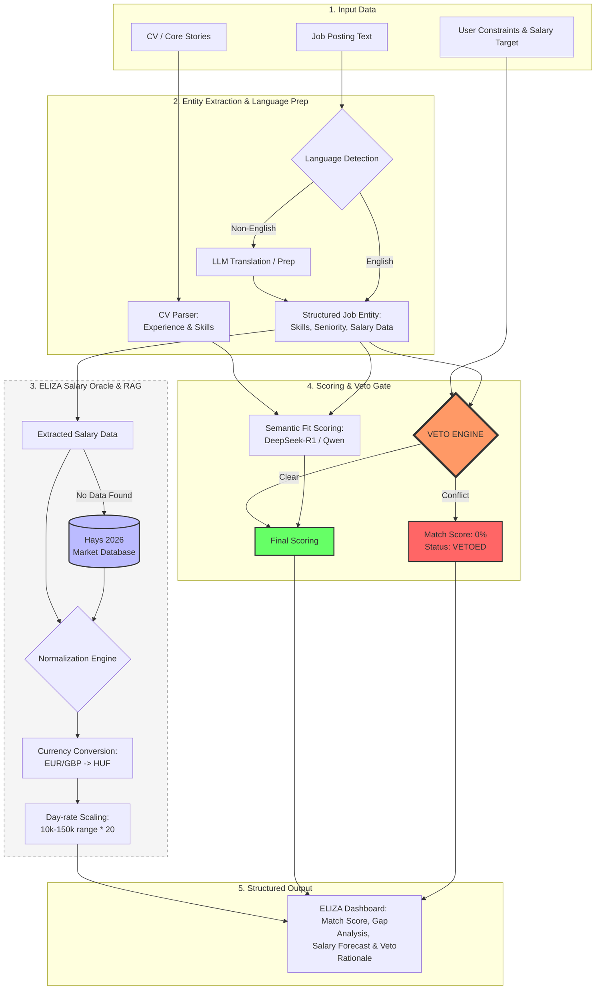

# ELIZA: Empathetic Link for Intelligent (Z)Job Acquire

**Local-first, deterministic job-fit copilot** for developers who want **transparent math**, not a mystery percentage. ELIZA is a **Copilot workflow**: it prioritizes quality, relevance, and user oversight over mass-automation. Paste a posting, compare it to your CV through a staged pipeline (parsing -> structuring -> matching -> scoring), then optionally draft application assets—all via **[Ollama](https://ollama.com)** on your machine.

---

## Why ELIZA

- **Fit-first** — ELIZA helps you decide whether to apply before generating assets.
- **Copilot UX** — user-in-the-loop by design; suggestions are visible and reviewable.
- **Deterministic pipeline** — parsing, structuring, matching, and scoring are explicit stages with auditable outputs.
- **Auditable scores** — the semantic model returns **`score_components`**; the API **reconciles** the headline **`fit_score`** with the structured sum and the **6–7** lines of **`mathematical_breakdown`**.
- **Semantic highlights** — short phrases from the job text, labeled positive or negative, with rationale for the UI highlighter.
- **Constraint-aware** — saved preferences and hard vetoes (including explicit negative constraints conflicting with required skills) surface in the dashboard and API. **Target location** with a strong geography preference can trigger a deterministic location veto before semantic scoring.
- **CV skill curation** — after upload, Ollama can suggest extra skills; you approve or edit them on the dashboard before they feed the scorer.
- **Salary Oracle intelligence** — posted salary extraction with strict validation, currency-aware parsing, total-compensation signals (base/bonus/benefits), and market fallback benchmarks.
- **No cloud inference required** — PDF CV parsing and LLM calls stay on your network when Ollama runs locally.
- **Discovery Hub** — optional **Indeed**, **LinkedIn**, and **Profession.hu** sync into a local catalog, queued fit evaluation against your CV, and a **New matches** list with veto-aware scoring (same pipeline as manual paste).
- **Multiple local profiles** — dashboard **Active profile** + **New profile**; each profile has its own tree under `storage/users/<id>/` (CV, preferences, discovery catalog, domain JSON). The UI sends **`X-Eliza-Active-User`** on user-scoped API calls; list/create profiles via **`GET` / `POST /api/users`**.
- **LAN + remote dashboard access** — the Next.js server listens on **`0.0.0.0`** so other devices on the same Wi‑Fi can open the UI; optional **`ELIZA_GATE_PASSWORD`** shows a login screen. Away from home: use **Tailscale** (personal mesh) — no router port forward. Backend + Ollama stay on the host PC.

---

## Multi-user storage

- **Registry:** `storage/users/registry.json` — `{ users: [{ id, displayName, createdAt }], defaultUserId }`.
- **Per profile:** `storage/users/<id>/` holds `user_cv.json`, `user_preferences.json`, constraints/corrections/synonyms/tactics JSON, and **`discovery/`** (same filenames as before: `jobs.jsonl`, `dupe_index.json`, `suppressed_ids.json`, match lists, queue, progress, settings, …).
- **Migration:** if the registry does not exist yet but legacy files sit in `storage/` (`user_cv.json` and/or `storage/discovery/`), the server moves them under **`storage/users/default/`** once and writes the registry.
- **CV parse cache:** `.cache/cv_parses/<id>/` (per profile).

---

## Discovery Hub

The dashboard **Discovery Hub** panel drives listing ingestion and batch evaluation:

- **Providers** — toggle per source; sync pulls recent rows into a **local catalog** using **Playwright** (Chromium) where the site needs a real browser. Listings are **deduped within a run** and **across providers** via a persisted fingerprint index under the active profile: `storage/users/<id>/discovery/dupe_index.json`.
- **Keywords** — comma-separated search phrases; optional **Ollama**-suggested phrases you can approve into the active keyword set.
- **Target location** — the dashboard **Target location** (saved preference, sent on sync as `preferred_location`) narrows **Profession.hu** listing URLs to `/allasok/{city}` when the first comma-separated segment looks like a city (e.g. Budapest); country-only labels keep the national listing. **Indeed** (`hu.indeed.com` Playwright and RSS fallbacks) sets **`l=`** from the same rule (city vs **`Hungary`**). **LinkedIn** guest search uses the trimmed preference for its `location` parameter when set (otherwise Hungary).
- **Queue & progress** — jobs are evaluated with the same **pipeline** as a pasted posting; rows above your match threshold (and not vetoed) surface under **New matches**, with **company and title** on each row. The panel can **refresh match lists** when live stats change. After each sync, the server merges a **backlog** of pending catalog jobs (all providers in the configured tail window), not only the provider you just synced.
- **Re-evaluate** — **AI re-evaluate** (or `POST /api/discovery/reevaluate`) re-queues the catalog for scoring without a full re-fetch; useful after CV or constraint changes.
- **Suppressed listings** — jobs you remove with the trash control are stored as suppressed (**id + canonical URL**) in `storage/users/<id>/discovery/suppressed_ids.json` for the active profile and are skipped on sync, re-evaluate, and queue processing until cleared (covers duplicate catalog lines or id drift for the same posting).
- **API** — routes under **`app/api/discovery/`** (`sync`, `state`, `settings`, `matches`, `process-queue`, `progress`, `reevaluate`, …) require the same **`X-Eliza-Active-User`** header as other user-scoped routes. Domain helpers for synonyms and constraint tactics live under **`app/api/domain/`**. **`GET` / `POST /api/users`** and **`GET /api/ollama-models`** do not require the header.

**Optional server tuning** (see also comments in **`config/constants.ts`** and **`.env.example`**): `ELIZA_DISCOVERY_SYNC_EVAL_BATCH`, `ELIZA_DISCOVERY_QUEUE_DRAIN_BATCH`, `ELIZA_DISCOVERY_MAX_SEED_PHRASES`, `ELIZA_DISCOVERY_PLAYWRIGHT` (set `0` for HTTP-only / RSS-style paths where supported), `ELIZA_DISCOVERY_HTTP_FETCH_TIMEOUT_MS` (default **45s** for LinkedIn guest / Indeed RSS / Profession list HTTP), plus Profession.hu speed knobs `ELIZA_PROFESSION_FAST_NAV`, `ELIZA_PROFESSION_LITE_SETTLE`, `ELIZA_PROFESSION_DETAIL_VISITS`, `ELIZA_PROFESSION_FETCH_TIMEOUT_MS`.

**One-time setup for browser sync:** after `npm install`, install the Playwright browser bundle once:

```bash
npx playwright install chromium
```

Provider sites change often; sync may return HTTP errors or empty sets depending on region and automation policy. Use **manual job paste** for a guaranteed path through the pipeline.

---

## How it works

ELIZA follows a deterministic, pipeline-based flow from raw inputs to dashboard output:


```mermaid
flowchart TD
    %% Inputs
    subgraph Inputs ["1. Input Data"]
        J[Job Posting Text]
        C[CV / Core Stories]
        U[User Constraints & Salary Target]
    end

    %% Extraction & Prep
    subgraph Extraction ["2. Entity Extraction & Language Prep"]
        EN{Language Detection}
        TRANS[LLM Translation / Prep]
        JE[Structured Job Entity: \n Skills, Seniority, Salary Data]
        
        J --> EN
        EN -- Non-English --> TRANS
        TRANS --> JE
        EN -- English --> JE
        C --> CP[CV Parser: \n Experience & Skills]
    end

    %% The Oracle Logic
    subgraph Oracle ["3. ELIZA Salary Oracle & RAG"]
        RAG[(Hays 2026 \n Market Database)]
        EXT_SAL[Extracted Salary Data]
        
        JE --> EXT_SAL
        EXT_SAL -- No Data Found --> RAG
        
        NORM{Normalization Engine}
        EXT_SAL --> NORM
        RAG --> NORM
        
        CURR[Currency Conversion: \n EUR/GBP -> HUF]
        SCALE[Day-rate Scaling: \n 10k-150k range * 20]
        
        NORM --> CURR
        CURR --> SCALE
    end

    %% Scoring & Veto
    subgraph Analysis ["4. Scoring & Veto Gate"]
        SCO[Semantic Fit Scoring: \n DeepSeek-R1 / Qwen]
        VETO{VETO ENGINE}
        
        U --> VETO
        JE --> VETO
        CP --> SCO
        JE --> SCO
        
        VETO -- Conflict --> FAIL[Match Score: 0% \n Status: VETOED]
        VETO -- Clear --> PASS[Final Scoring]
    end

    %% Output
    subgraph Output ["5. Structured Output"]
        UI[ELIZA Dashboard: \n Match Score, Gap Analysis, \n Salary Forecast & Veto Rationale]
    end

    SCALE --> UI
    PASS --> UI
    FAIL --> UI
    SCO --> PASS

    %% Styling
    style VETO fill:#f96,stroke:#333,stroke-width:4px
    style RAG fill:#bbf,stroke:#333,stroke-width:2px
    style FAIL fill:#f66,stroke:#333,stroke-width:2px
    style PASS fill:#6f6,stroke:#333,stroke-width:2px
    style Oracle fill:#f5f5f5,stroke:#999,stroke-dasharray: 5 5
```

1. **Job / CV** — You provide posting text and a stored CV (uploaded PDF).
2. **Extraction** — **English-first:** a fast token-signal heuristic on job text and CV text decides whether to **skip** the LLM language/translation step. If confidence is low or the sample looks non-English (for example German orthography in the prefix), the pipeline runs **automatic translation prep**, then **structured entity extraction**. The CV path always extracts skills, seniority, and core stories.
3. **Pruning** — A compact CV profile is built for the scorer (token budget, noise-stripped experience lines).
4. **DeepSeek-R1 scoring** — Default stack targets **`deepseek-r1:8b`** (or any Ollama tag you select). A baseline literal score is merged with the LLM semantic review, **`score_components`**, and hard-veto logic.
5. **Salary Oracle** — Posted salary (when valid) is prioritized over benchmark lookup, with source tagging, currency, and compensation breakdown fields.
6. **UI mapping** — The Next.js dashboard and Chrome extension render fit gauge, breakdown, highlights, badges, salary forecast, asset hooks, and **Discovery Hub** controls.

Shared TypeScript contracts live under **`types/`**; limits and defaults under **`config/constants.ts`**.

---

## Benchmarks

On a typical **16 GB VRAM** workstation with **`deepseek-r1:8b`** pulled in Ollama, a full dashboard analysis (including extraction, pruning, semantic scoring, and salary oracle pass) commonly finishes in **~15–25 seconds** wall time. Actual latency varies with GPU class, CPU fallback, context size, and whether the **English-first** heuristic skips the LLM translation prep for both job and CV samples.

---

## Tech stack

| Layer        | Choice                                      |
| ------------ | --------------------------------------------- |
| App          | **Next.js** (App Router), **React**, **TypeScript** |
| Styling      | **Tailwind CSS** v4                          |
| Local AI     | **Ollama** (local-first inference) — JSON-capable models (**deepseek-r1:8b**, **llama3**, similar tags) |
| PDF          | **pdf2json** for CV text extraction          |
| Discovery    | **Playwright** (Chromium) + **cheerio** where HTML parsing suffices |
| Extension    | **Vite** + **React** (Chrome MV3 side panel) |

---

## Repository layout

| Path | Purpose |
|------|---------|
| `app/` | App Router pages, dashboard UI, API route handlers |
| `app/api/discovery/` | Discovery Hub sync, queue, matches, settings, keyword suggestions, re-evaluate |
| `app/api/upload-cv/` | PDF upload plus CV skill suggest / approve routes |
| `app/api/users/` | Profile registry list and create |
| `app/api/domain/` | Skill synonym and constraint-tactic JSON used by parsers and storage |
| `lib/` | Ollama client, parsers, generators, validation, storage |
| `lib/api/` | `withActiveUser` wrapper for per-profile routes |
| `lib/elizaFetch.ts` | Browser fetch helper (`X-Eliza-Active-User`, internal POST header) |
| `lib/pipeline/` | Staged pipeline, constraint vetoes, **location geography veto** |
| `lib/discovery/` | Provider fetchers, catalog, queue, cross-provider dedupe, suppressed IDs, Playwright helpers |
| `lib/cvSkills/` | Ollama-backed extra-skill suggestions from CV text |
| `data/salary/` | Hays HU benchmark JSON (`hays-hu-2026-enriched-v4.json` is the live oracle source) |
| `lib/ui/` | Shared dashboard tokens (e.g. Tailwind button class groups) |
| `lib/cv/`, `lib/benchmark/`, `lib/logging/` | CV helpers, optional stress benchmarks, structured logs |
| `scripts/` | Verification and tuning scripts (`*.mts`) |
| `types/` | Shared contracts (`PipelineOutput`, `discovery`, …) |
| `config/constants.ts` | Central limits, timeouts, default model tag; discovery backlog cap `DISCOVERY_SYNC_BACKLOG_MAX_JOBS` |
| `apps/extension/` | Chrome extension (`npm run build` → `dist/`) |
| `benchmarks/` | Default output directory for `npm run benchmark:ollama-tuning` (artifacts gitignored) |

User data is written under **`storage/users/<profileId>/`** at the project root (gitignored). See **Multi-user storage** above.

---

## Prerequisites

- **Node.js** 20+
- **npm**
- **[Ollama](https://ollama.com)** installed and on your **`PATH`** (so the Next.js server can run `ollama list`)
- **Discovery Hub only:** Chromium for Playwright — run **`npx playwright install chromium`** once after installing npm dependencies

---

## Quick Start (Windows)

After you have cloned the repo and run **`npm install`** once in the project folder:

- **To start the app**, double-click **`start-eliza.bat`** in the repository root.  
  It runs **`run-eliza.ps1`**, which clears the **`.next`** cache, frees **port 3000** if needed, opens a dedicated terminal running **`npm run dev`**, and then opens **http://localhost:3000** in your default browser.

You can also run the script directly: **`powershell -ExecutionPolicy Bypass -File .\run-eliza.ps1`**.

---

## Installation

### 1. Ollama (local inference)

Start the Ollama daemon, then pull the recommended reasoning model:

```bash
ollama serve
ollama pull deepseek-r1:8b
```

You can also pull an alternative model for smoke tests:

```bash
ollama pull llama3
```

Keep **`ollama serve`** running in a terminal (or as a service) while you use ELIZA.

### 2. Application

```bash
git clone https://github.com/NyiroM/Eliza.git
cd Eliza
npm install
cp .env.example .env.local   # optional; see file for OLLAMA_HOST
npm run dev
```

Open **http://localhost:3000**, upload a **PDF CV**, paste a job description, pick **`deepseek-r1:8b`** (or another installed tag), and run analysis.

### LAN access (same Wi‑Fi — step 1)

The full app (UI + API + storage + Ollama client) runs on **one host machine**. Other phones/laptops on the **same private network** can open the dashboard in a browser.

1. On the host: `cp .env.example .env.local` and set a shared gate password:

   ```bash
   ELIZA_GATE_PASSWORD=choose-a-strong-password
   ```

2. Start the server (`npm run dev` or `start-eliza.bat`). It binds to **`0.0.0.0:3000`** (use **`npm run dev:localhost`** if you want loopback-only).

3. On the host dashboard, open the **Network access** panel and copy a **LAN** URL (e.g. `http://192.168.1.42:3000`).

4. On another device on the same Wi‑Fi, open that URL, enter the gate password at **`/login`**, then use the dashboard as usual.

**Notes:** Step 1 uses plain HTTP on your LAN (password travels in cleartext on the Wi‑Fi). Windows Firewall may need to allow Node on port **3000** for private networks. **Do not** port-forward 3000 on your router — use Tailscale for remote access (step 2).

### Remote access (Tailscale — step 2)

For **single-user** access away from home, put the host and your phone/laptop on a **Tailscale** mesh. ELIZA stays off the public internet; no DynDNS and **no router WAN port forward**.

1. On the **ELIZA host**: install [Tailscale](https://tailscale.com), sign in, confirm `tailscale status` shows a `100.x` address (and MagicDNS name if enabled).
2. Keep **`ELIZA_GATE_PASSWORD`** set. Run ELIZA (`npm run start` for a long-lived host, or `npm run dev`). Ollama stays on this machine (`OLLAMA_HOST=http://127.0.0.1:11434`).
3. On your **phone or remote laptop**: install Tailscale with the **same account**, connect, then open a **Tailscale** URL from the host dashboard **Network access** panel (e.g. `http://100.x.y.z:3000`), or MagicDNS / optional **Tailscale Serve** HTTPS (`https://<machine>.<tailnet>.ts.net`).
4. Sign in at **`/login`**, then use the dashboard as on LAN.

**Router:** leave WAN closed for ELIZA — no port forward / DMZ / UPnP to port 3000. Optional: DHCP reservation for the host LAN IP (helpful for step 1, not required for Tailscale).

### Environment

See **`.env.example`**. Set **`OLLAMA_HOST`** if Ollama is not at `http://127.0.0.1:11434` (avoid `0.0.0.0`; use `127.0.0.1` or `localhost` for the client). Set **`ELIZA_GATE_PASSWORD`** when sharing the UI on LAN or Tailscale.

### Running on weak / CPU-only hardware

Without a GPU, inference is much slower and small models can misbehave. Tips:

- **Pick a small, schema-tuned model.** Only the **`gemma`**, **`qwen2.5`**, and **`llama3.1:8b`** families get JSON-Schema-constrained output for the semantic-fit / relevance calls; other tags (e.g. `llama3.2`) may generate until the timeout. **`qwen2.5:3b`** runs a full pipeline analysis in roughly a minute on a modern 4-core CPU. Select it via the dashboard model dropdown (or `POST /api/user-preferences`).
- **Force schema on any model** with **`ELIZA_OLLAMA_FORCE_SCHEMA=1`** to keep unconstrained models bounded.
- **Tune the runtime** with **`OLLAMA_TIMEOUT_MS`**, **`OLLAMA_NUM_PREDICT`** (lower to cap generation length), and **`OLLAMA_NUM_CTX`** (see `.env.example`).

### Chrome extension

```bash
cd apps/extension
npm install
npm run build
```

Load **`apps/extension/dist`** as an unpacked extension. Set **`VITE_ELIZA_API_URL`** at build time if the API is not on `http://localhost:3000`.

---

## Scripts

| Command | Description |
|---------|-------------|
| `start-eliza.bat` / `run-eliza.ps1` | Windows: clean **`.next`**, free port **3000**, **`npm run dev`** (LAN bind) in a new window, open the app in the browser |
| `npm run dev` | Next.js development server on **`0.0.0.0:3000`** (LAN-reachable) |
| `npm run dev:localhost` | Dev server bound to **`127.0.0.1` only** |
| `npm run build` | Production build |
| `npm run start` | Production server on **`0.0.0.0:3000`** |
| `npm run start:localhost` | Production server on loopback only |
| `npm run lint` | ESLint |
| `npm run test:salary-oracle` | Salary Oracle self-test suite (fixture-based) |
| `npm run test:salary-titles` | Title→benchmark match verifier |
| `npm run test:salary-bench-titles` | Salary oracle title benchmark (EN sample set) |
| `npm run test:salary-bench-titles-hu` | Salary oracle title benchmark (HU sample set) |
| `npm run test:location-geography-veto` | Location geography veto unit checks |
| `npm run test:prospecting-veto` | Prospecting / new-business hard veto unit checks |
| `npm run debug:profession-microsteps` | Scripted Profession.hu Playwright microsteps (debug) |
| `npm run test:profession-search` | Integration check for Profession.hu search flow |
| `npm run test:indeed-job-url` | Indeed job URL / listing assumptions verifier |
| `npm run test:job-id-canonicalization` | Job id canonicalization verifier |
| `npm run benchmark:ollama-tuning` | Local Ollama matrix tuning; writes under **`benchmarks/`** (ignored by git) |
| `npx tsx scripts/verify-discovery-dedupe.mts` | Sanity-check cross-provider duplicate skipping (fixture-style) |
| `npx tsc --noEmit` | Typecheck (also run in CI on PRs to `main`) |

---

## Salary Oracle notes

- **Posted salary first**: salary directly stated in the job ad is preferred when it passes strict semantic validation.
- **Strict anti-hallucination guards**: extraction requires salary-keyword proximity and excludes non-salary contexts (employee counts, country counts, area measurements, etc.).
- **Fallback behavior**: unlikely extracted values automatically fall back to benchmark data.
- **Benchmark dataset**: `data/salary/hays-hu-2026-enriched-v4.json` (Hays HU 2026 + synthetic 2026 market enrichment — aliases, `search_vector`, `inferred_skill_tags`, `skill_premium_multiplier`, `market_heat`, `market_confidence`).
- **Enrichment-aware matching**: weighted axes per the dataset guide (role 35% · search_vector 25% · inferred_skill_tags 15% · function 10% · job_family 10% · industry 5%), legacy title guards (Scrum Master, AI vs IAM, …) preserved.
- **Skill premium + market heat**: when the job text exposes hot skills overlapping `inferred_skill_tags`, min/max/modus are lifted by `skill_premium_multiplier`; `market_heat` (`very_hot`/`hot`) nudges confidence and is surfaced in the rationale.
- **Compensation structure**: API returns base salary plus bonus/benefits indicators, source (`posted` or `market_benchmark`), and detected currency.
- **UI rendering**: dashboard salary forecast shows source, currency, and base/bonus/benefits breakdown.

---

## Contributing

See **[CONTRIBUTING.md](./CONTRIBUTING.md)**.

---

## License

**MIT** — see **[LICENSE](./LICENSE)**.
